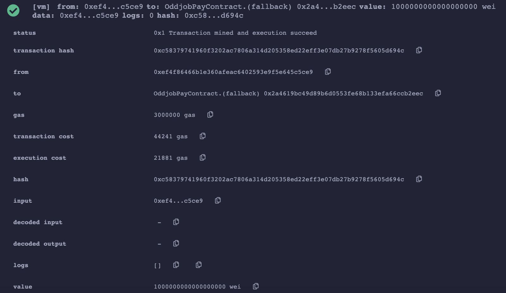

# Welcome to My Smart Contract

I made this contract with the help of tutorials I found online (Links below). 
  This was made as part of my Tech Talk presentation while I was a student at Code Chrysalis. The full presentation can be found on their [YouTube channel](https://www.youtube.com/c/codechrysalis)

This was a talk about "What is BlockChain, and how can it help your Business?"

---

### If you would like to use this contract

**Here's how:**

* I recommend testing this on the Ethereum browser testing site [Remix](https://remix.ethereum.org/). It is a great way to get started on Smart Contracts and how they work.

### Here is a picture using Remix to test the contract successfully

---

### My sources

* Tutorial for this contract from RubyGarage (https://rubygarage.org/blog/ethereum-smart-contract-tutorial)

---

### Future improvements

* As this was my first time with making a smart contract, I would like to make it more secure and have more options. 
* I would also like to build more contracts of different types of transactions
* In the future, I would like to set up and deploy this to the actual Ethereum Blockchain network

---

### Thank you

Please feel free to leave comments or issues. I would love feedback and also examples for future improvements.
